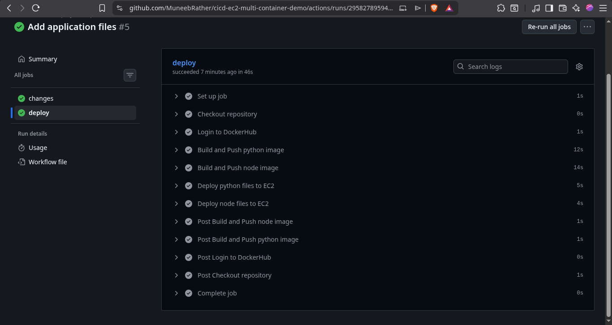
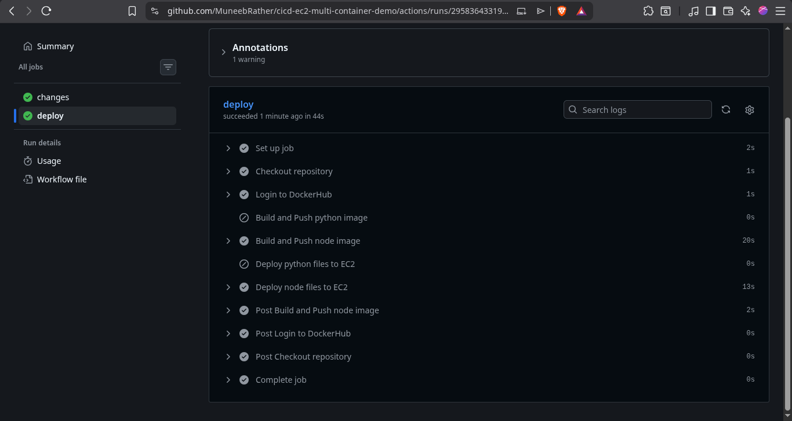
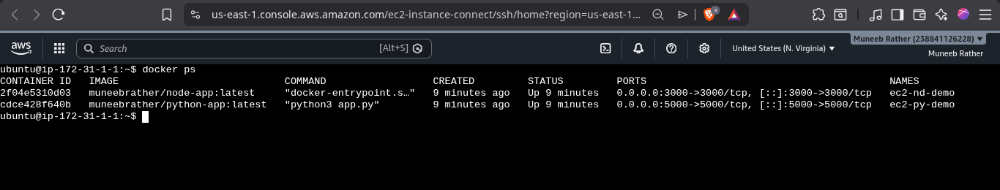
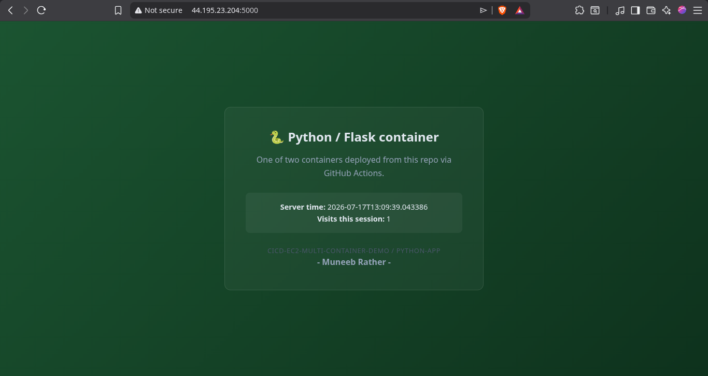
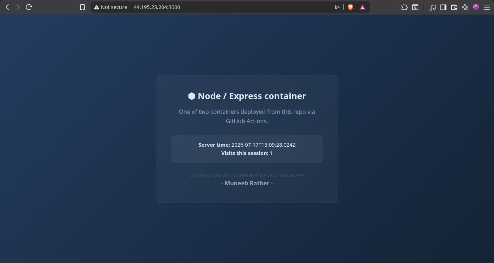

# cicd-ec2-multi-container-demo

A CI/CD pipeline that builds **two independent Docker containers** from a single repository and deploys both to the same **Amazon EC2** instance using **GitHub Actions**. Only the container(s) whose source folder changes are rebuilt and redeployed on each push to `main`.


| Repo | Focus |
|------|------|
| cicd-s3-demo | CI/CD → S3 static website deployment |
| cicd-ec2-single-container-demo | CI/CD → Docker Hub → EC2 → Single container |
| **cicd-ec2-multi-container-demo** (this repo) | CI/CD → EC2 → Two independent containers in one repository |
| cicd-branching-demo | Docker Compose + Branching strategy + PR validation |

---

## What this repo demonstrates

- A single repository containing **two independent applications**, each with its own Dockerfile and build context
- Detecting which application changed using `dorny/paths-filter`, so only the modified application is rebuilt and redeployed
- Conditional GitHub Actions steps using `if:` expressions based on the outputs of a dedicated `changes` job
- Running two independently named Docker containers on the same EC2 instance
- Separate `.dockerignore` files for each application's build context


---

## Architecture

```text
Push to main
      │
      ▼
Changes job
(detect modified folders)
      │
      ▼
Deploy job
      │
      ├── Login to Docker Hub
      ├── Build & push Python image (if changed)
      ├── Build & push Node image (if changed)
      ├── Deploy Python container (if changed)
      └── Deploy Node container (if changed)
                │
                ▼
      Updated containers running on EC2
```

---

## Applications

- **python-app/** — Flask application running on port **5000**
- **node-app/** — Express application running on port **3000**

Both applications generate their HTML directly in the server code to keep the repository focused on the multi-container CI/CD workflow rather than frontend structure.

---

## Setup

1. Write and test both Dockerfiles locally.
2. Launch an EC2 instance and install Docker.
3. Configure the EC2 security group to allow:
   - SSH (22)
   - Port 5000
   - Port 3000
4. Create Docker Hub repositories for both applications.
5. Configure the following GitHub Secrets:
   - `DOCKERHUB_USERNAME`
   - `DOCKERHUB_TOKEN`
   - `EC2_HOST`
   - `EC2_USER`
   - `EC2_SSH_KEY`
6. Push to `main`. Only the application(s) whose folder changed will be built and redeployed.

---

## Workflow file

See **`.github/workflows/deploy.yml`**.

---

## Progress

- [x] Python application created
- [x] Node.js application created
- [x] Both Dockerfiles written and tested
- [x] EC2 instance launched with Docker installed
- [x] Required ports opened in the security group
- [x] GitHub Secrets configured
- [x] `changes` job implemented using `dorny/paths-filter`
- [x] Conditional build, push, and deployment steps configured
- [x] Selective deployments verified
- [x] Both containers running successfully on EC2

---

## Screenshots

### GitHub Actions — Full workflow run

_Screenshot showing both applications being built and deployed._



---

### GitHub Actions — Selective deployment

_Screenshot showing one application's steps skipped when only the other application's folder changed._



---

### EC2 — Running containers

_Screenshot of `docker ps` showing both containers running._



---

### Live Applications

**Python application**



**Node.js application**



---

## What I learned

- Why separate build contexts require separate `.dockerignore` files
- How to detect folder-level changes using `dorny/paths-filter`
- How to use job outputs together with conditional `if:` expressions
- How to deploy multiple containers independently from a single GitHub Actions workflow
- The difference between workflow trigger filters (`paths-ignore`) and conditional execution (`if:`)

---

## Author

**Muneeb Rather**